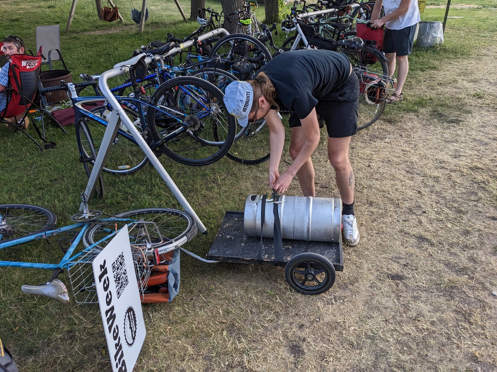
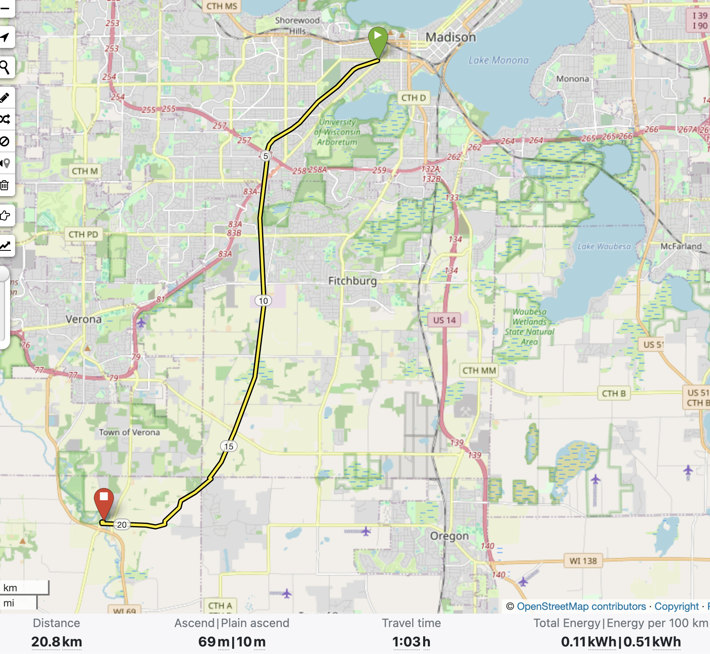

# Fetch the Keg Ride

**Update June 5: Note that the air quality is not great today. The ride is happening. See you tonight!**

The [Hop Garden](https://www.thehopgarden.net/) is one of our beverage sponsors for the [Madison Bike Week](https://www.madisonbikes.org/bikeweek) Party on Friday! But how are we going to get the keg from Paoli to Brittingham Park?? You guessed right: By bike! Meet at Crazylegs Plaza (Regent/Monroe intersection) for a 5:30pm (sharp) departure. We’ll ride the SW Path and Badger State Trail to the Hop Garden at a leisurely pace (12 mph) and after a beverage/food break return the same way. Rain or shine. Distance is about 27 miles. If you want to go faster or slower, that's cool. Route is all on off-street paved paths except for the last section, which is on shoulderless country roads with light to moderate traffic and some hills. Please bring lights.

## The date

The ride will happen on Thursday, June 5th. Departure is 5:30pm, sharp.

## The route

27 miles (out and back), 550 ft of elevation 

https://bkrtr.de/wszta

## FAQ
- Do I need to RSVP?
    - Nope, just show up!
- Do I need to have lights on my bike?
    - Yes.
- Do I need to pay for my own food and drink at the Hop Garden?
    - Yes.
- Is the route safe?
    - You're doing this at your own risk. Much of the route is on the Southwest Path and Badger State Trail, i.e. no cars. The last bit into Paoli is on a town road with no shoulders or bike lanes.
- If my bike breaks down on the ride, will someone help me?
    - There are lots of nice people on the ride, but ultimately it's up to you to have a backup plan.
