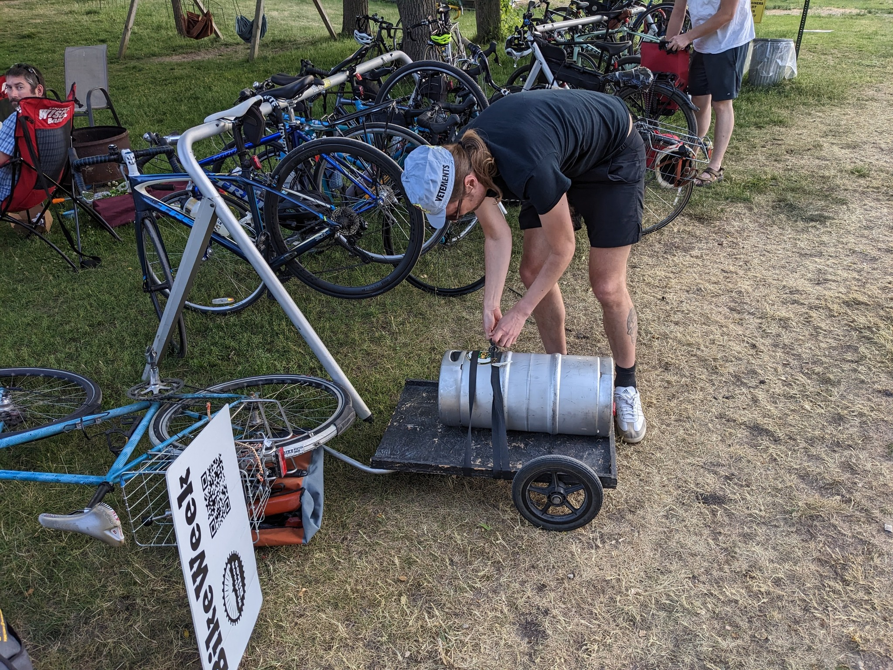
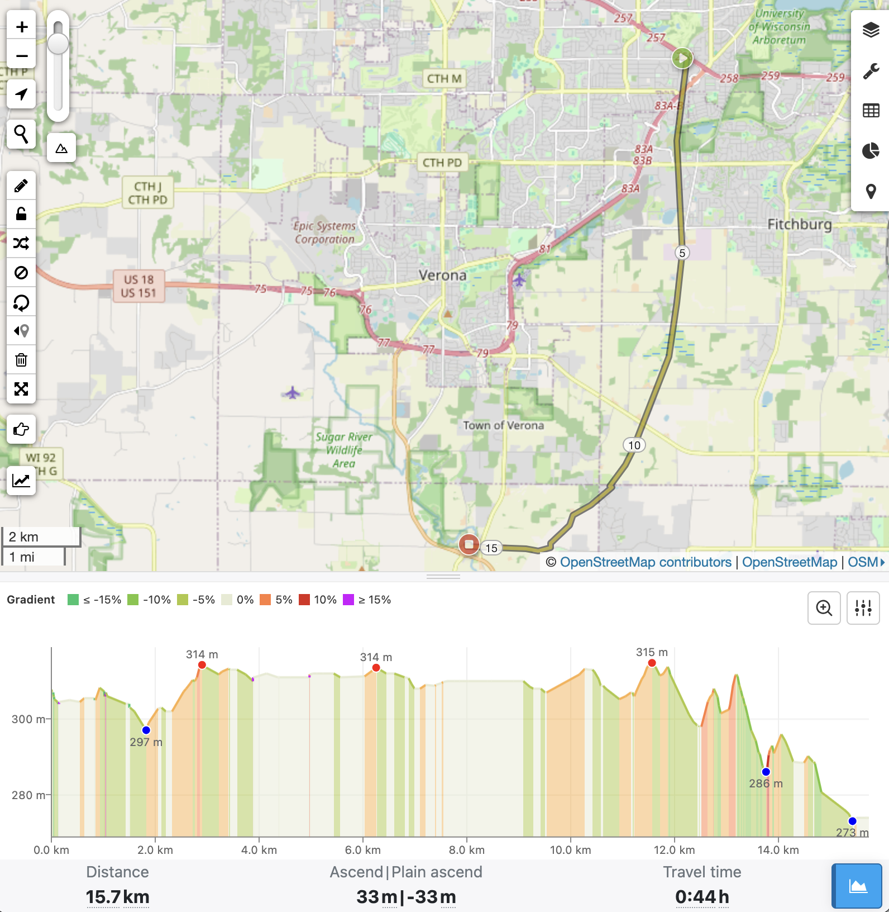

# Fetch the Keg Ride 2026

*** Bike Week 2026 is over. Thanks to everyone who joined me on the ride!***

The [Hop Garden](https://www.thehopgarden.net/) is one of our beverage sponsors for the [Madison Bike Week Party on Friday](https://www.madisonbikes.org/events/bikeweek-2026/events/paul-lata)! But how are we going to get the keg from Paoli to Brittingham Park?? You guessed right: By bike! 

Meet at the Beltline Overpass on the Southwest Path (at Pacific Cycle) for a 5:45pm (sharp) departure. We'll ride the SW Path and Badger State Trail to the Hop Garden at a leisurely pace (12 mph) and enjoy the Hop Garden's beverage and food option. For the way back, ride at your own pace or ride with the keg. Rain or shine. Distance is about 20 miles total. The route is all on off-street paved paths except for the last section, which is on shoulderless country roads with light to moderate traffic and some hills. Please bring lights and make sure you have a trail pass. 

People who want to go faster: The main group with the trailer will go the usual 12 mph. Faster folks can start first and ride their own pace. We'll meet ya at the Hop Garden.

## The date

The ride will happen on Thursday, June 4th, 2026 Departure is 5:45pm, sharp.

## The route

20 miles (out and back), 550 ft of elevation 

[https://bkrtr.de/gbrh6](https://bkrtr.de/gbrh6)

## FAQ
- Do I need to RSVP?
    - Nope, just show up!
- What if the weather is bad?
    - With the exception of severe weather (thunderstorms, hail, etc.), the ride is going to happen. Check this page to see any updates.
- Do I need to have lights on my bike?
    - Yes.
- Do I need to pay for my own food and drink at the Hop Garden?
    - Yes. (maaaaybe there will be a deal on offer)
- Is the route safe?
    - You're doing this at your own risk. Much of the route is on the Southwest Path and Badger State Trail, i.e. no cars. The last bit into Paoli is on a town road with no shoulders or bike lanes.
- If my bike breaks down on the ride, will someone help me?
    - There are lots of nice people on the ride, but ultimately it's up to you to have a backup plan.
- Are e-bike riders welcome?
    - Class 1, 2, and 3 e-bike riders are definitely welcome. 
